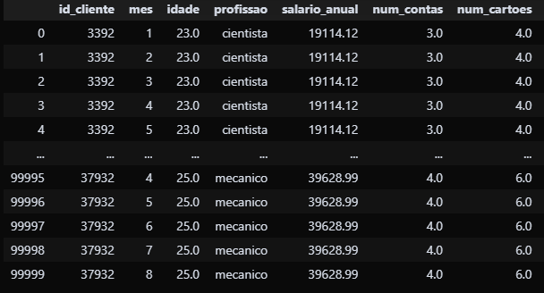
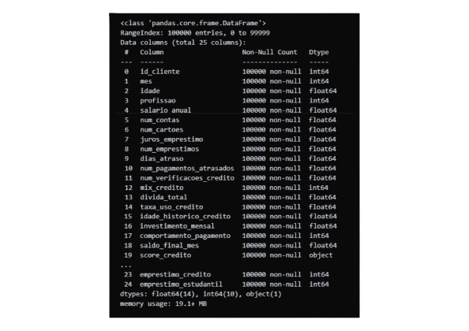
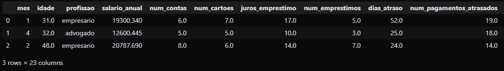
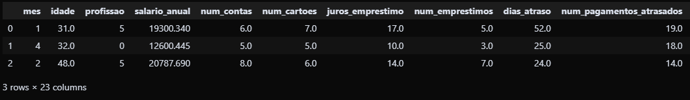

# Projeto Python IA: Inteligência Artificial e Previsões

### Case: Score de Crédito dos Clientes

Você foi contratado por um banco para conseguir definir o score de crédito dos clientes. Você precisa analisar todos os clientes do banco e, com base nessa análise, criar um modelo que consiga ler as informações do cliente e dizer automaticamente o score de crédito dele: Ruim, Ok, Bom.

Arquivos da aula: [Link para os arquivos do projeto](https://drive.google.com/drive/folders/1FbDqVq4XLvU85VBlVIMJ73p9oOu6u2-J?usp=drive_link)

---

## Entendimento do Desafio

O objetivo deste projeto é desenvolver um modelo de **Inteligência Artificial** capaz de analisar as características de clientes e classificar seu perfil de crédito. A classificação será dividida em três categorias:

- **Good** (Boa): Cliente com bom perfil de crédito.
- **Standard** (OK): Cliente com perfil de crédito padrão.
- **Poor** (Ruim): Cliente com perfil de crédito de risco.

## 1. Importação da Base de Dados

Nesta etapa, a base de dados de clientes, `clientes.csv`, é importada para a análise. A biblioteca `pandas` é utilizada para carregar os dados em um `DataFrame`.

# Descrição dos scores de crédito
# Score de crédito = Nota de crédito:
# Good = Boa
# Standard = OK
# Poor = Ruim

---

### 2. Preparação da Base de Dados

Nesta etapa, a base de dados é preparada para o treinamento do modelo de Inteligência Artificial. As colunas de texto (tipo `object`) precisam ser transformadas em valores numéricos, pois a maioria dos algoritmos de machine learning não consegue trabalhar diretamente com texto. A técnica utilizada aqui é o `LabelEncoder`, que atribui um número único para cada categoria de texto em uma coluna.

Primeiro, verificamos o tipo de dados de cada coluna.

# int -> numero inteiro
# float -> numero com casa decimal
# object -> texto

---

### Passo 3 - Selecionar os dados para treinamento e teste

---

### Passo 4 - Treinar a Inteligência Artificial e criar o modelo

---

### Passo 5 - Avaliar e escolher o melhor modelo

---

### Passo 6 - Usar o melhor modelo para fazer previsão de novos clientes

Este é o estágio final, onde o modelo treinado é aplicado a novos dados de clientes para gerar as previsões de score de crédito. É fundamental que os novos dados passem pelas mesmas etapas de transformação que os dados de treino, para que o modelo possa interpretá-los corretamente.

---

### Passo 7 - Usar o melhor modelo para fazer previsão de novos clientes

Nesta etapa final, o modelo de machine learning que foi treinado com sucesso é utilizado para fazer previsões em dados de clientes que ele nunca viu antes. É crucial que a nova base de dados passe pelas mesmas transformações que a base de dados de treino, garantindo que o modelo possa processá-la corretamente.

